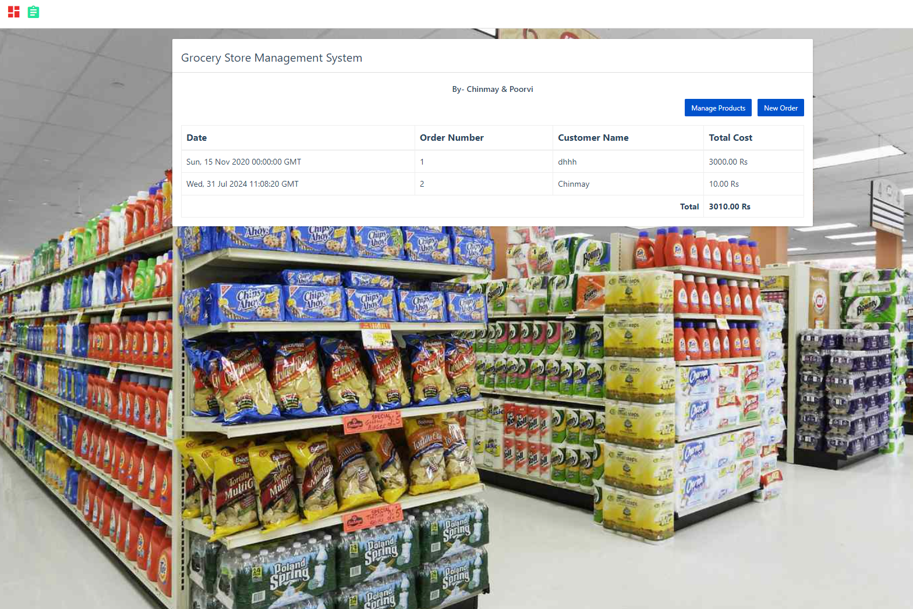
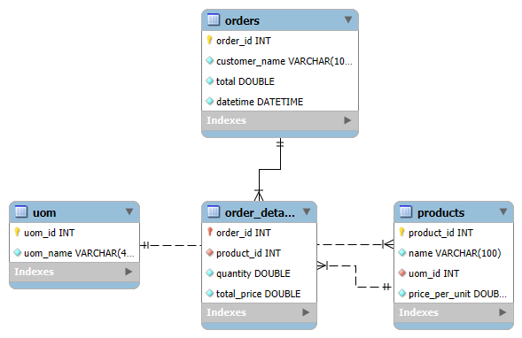

# Grocery Store Management System (GSMS)



## Overview

The Grocery Store Management System (GSMS) is a web-based application designed for managing products and orders in a grocery store. The system includes functionalities for viewing, adding, and deleting products, as well as managing orders.

## Technologies Used

- **Python**: For scripting and database operations.
- **MySQL**: For database management.
- **HTML/CSS**: For front-end design and layout.
- **JavaScript**: For interactivity and client-side scripting.
- **Flask**: For handling backend logic and API endpoints.

## Installation

### Prerequisites

- **Python 3.x**: Ensure Python 3 is installed.
- **MySQL**: Ensure MySQL is installed and running.
- **pip**: Python package manager for installing dependencies.

### Steps

1. **Clone the Repository**

2. **Install Dependencies**

   Install the required Python packages:

   ```bash
   pip install -r requirements.txt
   ```

   Ensure you have the following dependencies in `requirements.txt`:

   ```
   mysql-connector-python
   flask
   ```

3. **Setup the Database**

   - Create a new MySQL database.
   - create a required tables and make sure merge some things using foreign key.
  
   - 

4. **Configure Database Connection**

   Modify the `sql_connection.py` file to include your database credentials:

   ```python
   def get_sql_connection():
       import mysql.connector
       connection = mysql.connector.connect(
           host='your-database-host',
           user='your-database-username',
           password='your-database-password',
           database='your-database-name'
       )
       return connection
   ```

5. **Run the Application**

   If using Flask for the web application, start the Flask server:

   ```bash
   flask run
   ```

   Or run a Python script for direct execution:

   ```bash
   python your_script.py
   ```

## Code Description

### Database Operations

- **`get_all_products(connection)`**: Retrieves all products with their unit of measure (UOM) details from the database.
- **`insert_new_product(connection, product)`**: Inserts a new product into the `products` table.
- **`delete_product(connection, product_id)`**: Deletes a product based on the `product_id`.

### Frontend

- **HTML/CSS**: Provides the structure and style of the user interface, including navigation and modals.
- **JavaScript**: Manages client-side interactivity and modal handling.

## Usage

- **View Products**: Access the product management page to view all products.
- **Add Product**: Use the modal form to add new products.
- **Delete Product**: (Functionality to be implemented) Delete products from the database.


## License

This project is licensed under the MIT License. See the [LICENSE](LICENSE) file for more details.


